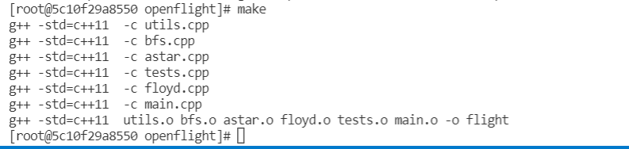
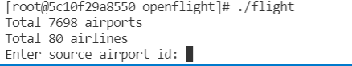
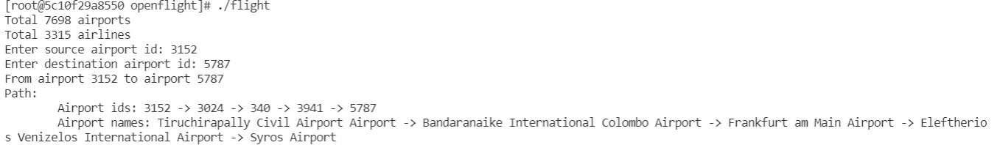

# yuhanw11-ttlong4-tli94
Final Project

# Build and Run
Move into the `code` folder, run `make` 

  

then run `./flight` for the main program. 

  

Input the id of your source airport id and destination airport id (airport id you can find in `airlines-small.csv` or `airlines.csv`) 

# Sample output

  

You can get the result in the terminal.

# Change algorithm and dataset
The default algorithm use in the project is Floyd-Warshall algorithm. If you want to change to the BFS or a star algorithm, go to main.cpp line 44 to 51, and command out `auto path = floyd(airlines, src, dst);`, then un-command the algorithm you want to use, and change the  `airlines-small.csv` to `airlines.csv`

# Final Project Video 
To view a video of how do we develop our project,  [click here](https://youtu.be/E-J9AbdeFbQ).

